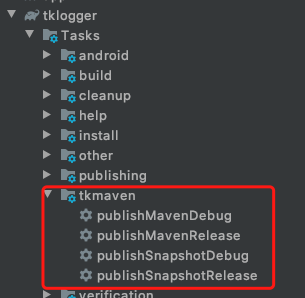

# Shper TK-Maven
-------

## New version

[](https://bintray.com/shper/maven/TK-Maven)


## Prerequisites

The version of the Gradle requires to match TK-Maven's version.

### TK-Maven version description

| TK-Maven | Support <br /> Gradle version | Support <br /> Android build tools |
|:---:|:---:|:---:|
| [](https://bintray.com/shper/maven/TK-Maven) | >= 6.0.0 | >= 4.0.0 |
| [](https://bintray.com/shper/maven/TK-Maven/1.0.1/link) | <= 5.6.4 | <= 3.6.3 |


## Getting Started

-------

### Step 1

Add the TK-Maven to your `buildscript`:

```
buildscript {
    repositories {
        maven{ url 'https://dl.bintray.com/shper/maven' }
    }

    dependencies {
        // TK-Maven 工具
        classpath 'cn.shper.plugin:tk-maven:<last_version>'
    }
}
```

### Step 2

Add the your username and password to your `local.properties`:


```
# Maven's username and password
tk-maven.userName=XXX
tk-maven.password=XXX

# Bintray's user and apikey
tk-maven.bintray.user=XXX
tk-maven.bintray.apiKey=XXX
```

### Step 3

Add the tkmaven extension to your `build.gradle`:

```
apply plugin: 'tk-maven'
tkmaven {
   groupId = "cn.shper.plugin"
   artifactId = "tk-maven"
   version = "1.0.0"

   repository {
        url = "https://maven.shper.cn/release"
        userName = "XXX"
        password = "XXX"

        sourcesJar = false
        javadocJar = true
   }

   snapshotRepository {
        url = "https://maven.shper.cn/snapshots"
        userName = "XXX"
        password = "XXX"

        sourcesJar = true
        javadocJar = true
    }

    bintray {
        repo = "maven"
        userOrg = "XXX"
        name = "TK-Plugin"
        desc = 'Shper's Plugin for Gradle'
        websiteUrl = "https://www.shper.cn"
        vcsUrl = "https://www.shper.cn"
    }

}
```

### Step 4
Start to publish you library.




## License
-------

    Copyright 2020 Shper
    
    Licensed under the Apache License, Version 2.0 (the "License");
    you may not use this file except in compliance with the License.
    You may obtain a copy of the License at
    
       http://www.apache.org/licenses/LICENSE-2.0
    
    Unless required by applicable law or agreed to in writing, software
    distributed under the License is distributed on an "AS IS" BASIS,
    WITHOUT WARRANTIES OR CONDITIONS OF ANY KIND, either express or implied.
    See the License for the specific language governing permissions and
    limitations under the License.
